# Introduction

## 2. Design focus 
---
### 2.1 Assembly
- The cansat should be easy to assemble and disassemble.
### 2.2 Versatility
- The cansat should be usable in variable situations.
### 2.3 Accessibility
- The cansat’s software should be easy to access.
### 2.4 Stability
- The cansat’s overall structure should be stable and durable. 
 
##	3. Concept design
---
### 3.1 Assembly
- Every parts, bolts and nuts must be able to be assembled by hands or simple mechanical tools (screw driver, wrench or plier).
- Especially, it’s supposed to be tap hole that have to be frequently disassembled.

### 3.2 Versatility
- The electrical system and the external frame should be separately designed.
- The cansat’s function can be simply changed by replacing several boards.

### 3.3 Accessibility
- The software system must be accessible with some cables without disassembling.
- At least, USB and HDMI should be usable without disassembling.

### 3.4 Stability
- External frame have to absorb most stresses and damages. So, internal system (electrical system) have to be effectively protected.
- Mass center is supposed to be on bottom and rear side of the cansat.

### 3.5 Others
- Metal frame should not interfere electromagnetic components (GPS, Wifi, Compass, etc). So, the components should be on outside of the metal frame.
- The cameras should be headed to horizontal front. 
- 
## 4. Detail design
---
### 4.1 Assembly View
 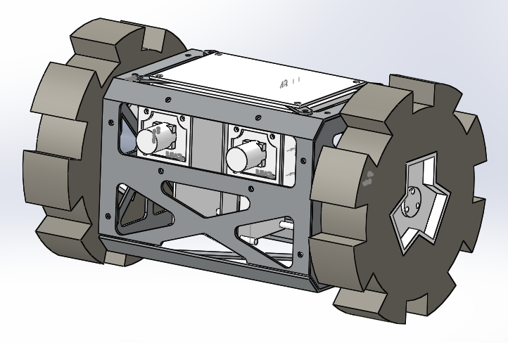
Figure 1 Front view
 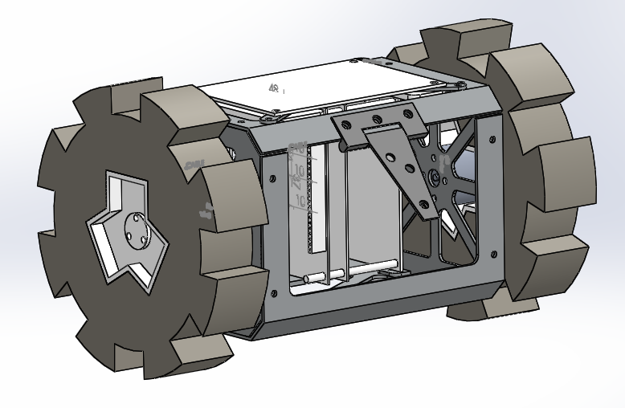
Figure 2 Rear view
 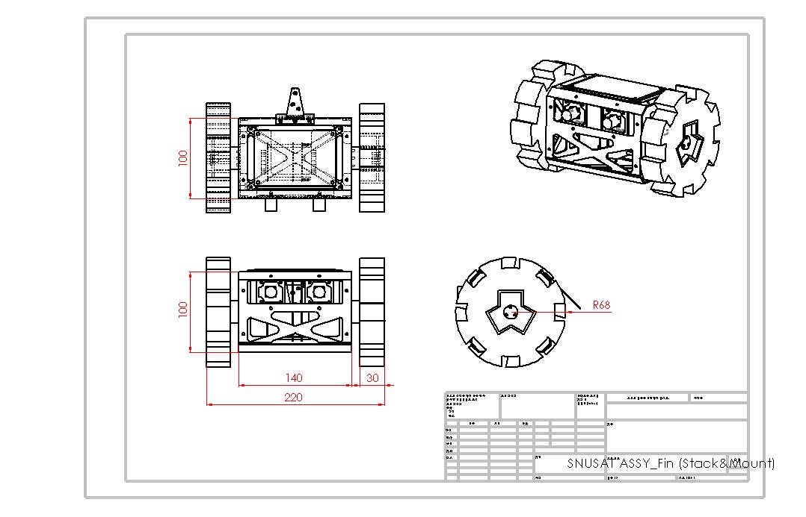
Figure 3 Assembly drawing
### 4.2 Exploded view
 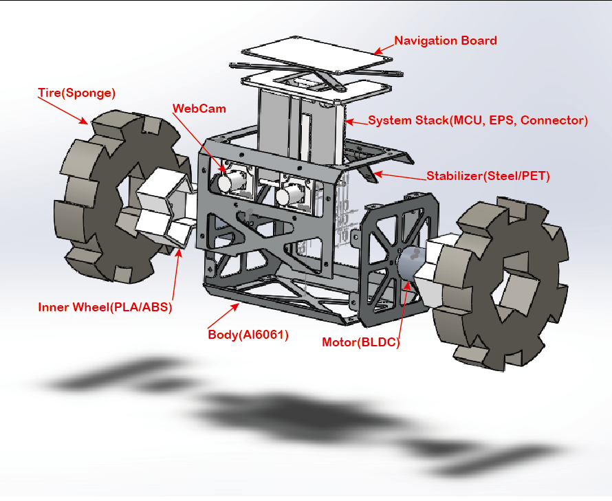

### 4.3 Mass Budget

| Category |	Part Name |	Mass(g) |	Number |	Total |	P/M |
| -- | -- | -- | -- | -- | -- |
| MCU |	Odroid U3 |	32 |	1	| 32 |	P |
|	| U3 IO Shield |	26 |	1 |	26 |	P |
| Motor |	NTM Prop Drive 28-30S 800kV/300W Brushless Motor (short shaft version) |	65 |	2	| 130 |	P |
| Motor Driver |	MULTISTAR SBEC 4A 20A (480Hz 2-6 LIXX) |	30 |	2	| 60 |	P |
| Camera	| EYEVIEW DJ-1000 |	20 |	2	| 40 |	P |
| Battery |	ZIPPY Compact 1300mAh 4s 40C Lipo Pack |	148 |	1 |	148 |	P |
|	| Turnigy nano-tech 300mAh 2S 35-70C Lipo Pack |	17 |	1	| 17 |	P |
| PCBs |	EPS board |	48 |	1 |	48 |	M |
|	| Connector board |	21 |	1 |	21 |	M |
| |	Navigation board |	38	| 1	| 38 |	M |
|Structure|	Body1	| 43| 	1 |	43 |	M |
| |	Body2 |	41 |	1	 |41 |	M| 
| | Side |	25 |	2 |	50 |	M |
| | System stack(ABS) |	14 |	1 |	14 |	M |
| |	System stack cover(Al)	| 8 |	1 |	8 |	M |
| |	Camera mount	| 4 |	1 |	4 |	M |
|Wheel |	Sponge & Tape measured	| 37| 	2|	74	|M|
| |	3D Printed part|	17|	2|	34|	M|
|Stabilizer	|Hinge	|40|	1|	40|	M|
|Capsule	|Capsule(PP sheet)	|41	|1	|41|	M|
|Parachute	|Standard Low-Porosity 1.1 Ripstop Parachutes	|111|	1|	111	|P|
|etc	|Wires, bolt,| |	|		28|	P|
| Total	|  |  | |1048| ||	
※ P = Purchased part, M = Manufactured part
※ We removed a radiator from Odroid U3 to reduce the total mass.
※ The mass of wheel, stabilizer and etc can be different from above. 

## 5. Manufacture
---
### 5.1 Body Structure (D-10-02)
 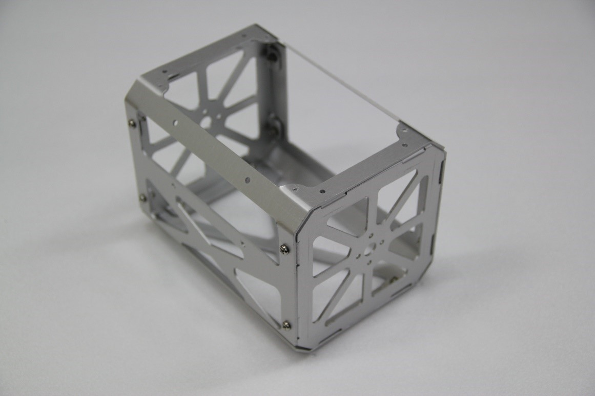
Figure 4 Body structure (without system stack cover)
 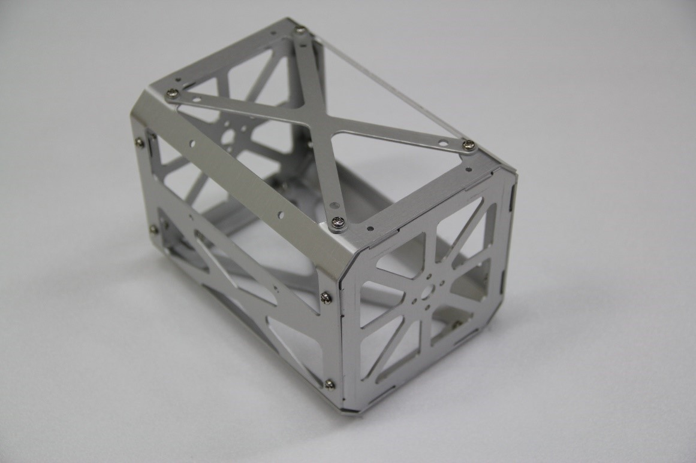
Figure 5 Body structure (with system stack cover)
Caution! You have to assemble motors before you assemble the side frame.

### 5.2 Wheel Structure (D-10-03)
 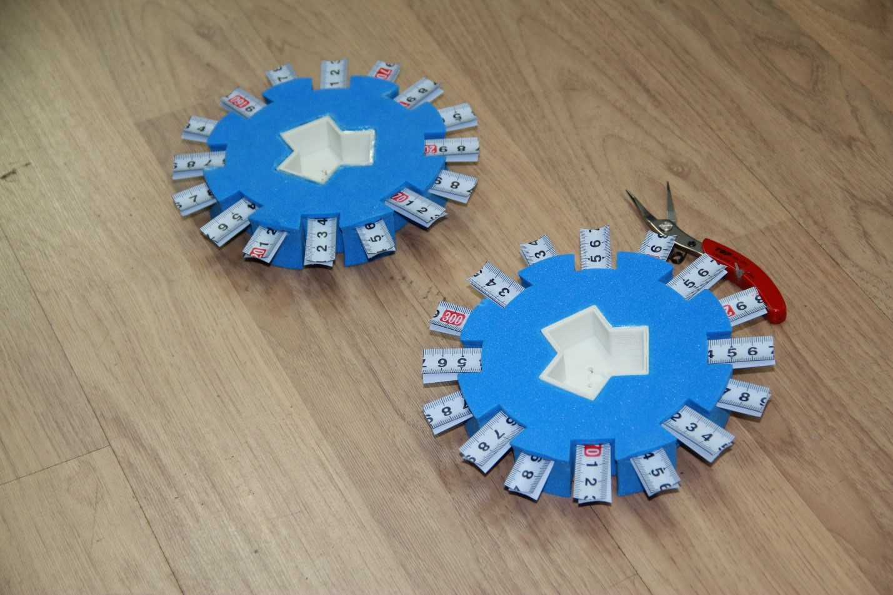
Figure 6 Assembled tire
### 5.3 Stabilizer Structure (D-10-06)

### 5.4 System Stack (D-20-01)

### 5.5 Assembling Process
①	Prepare all components in the picture below.
 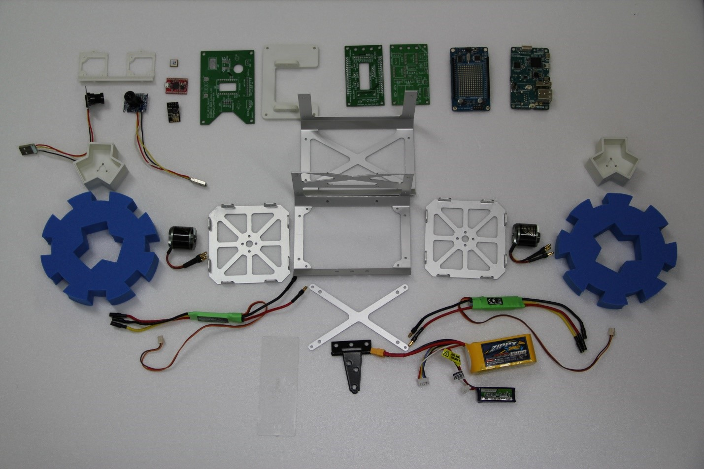
Figure 7 Whole components
②	Assemble two wheels with the Inner wheel (manufactured with 3D printer), the tire and tapeline. (Figure 6)
③	Assemble wheels, motor and side frame together.
  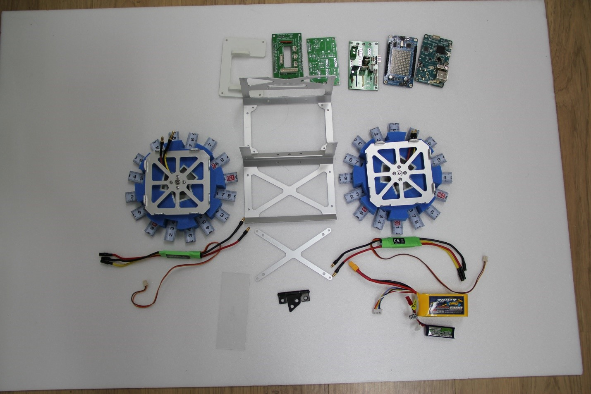
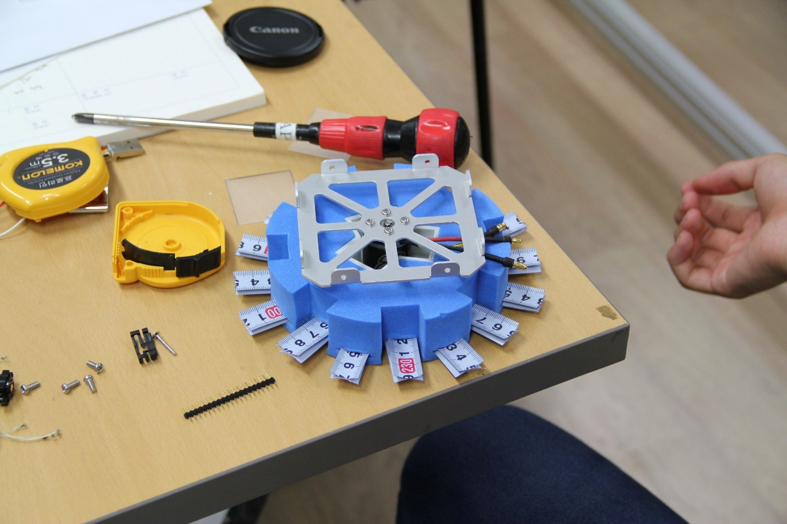
Figure 8 Assembled side part
④	Assemble the side parts with one of the body frame into one part. (Figure 9)
⑤	Assemble the system stack (consists of MCU, arduino shield, connector board, EPS and system stack structure manufactured with 3D printer)
 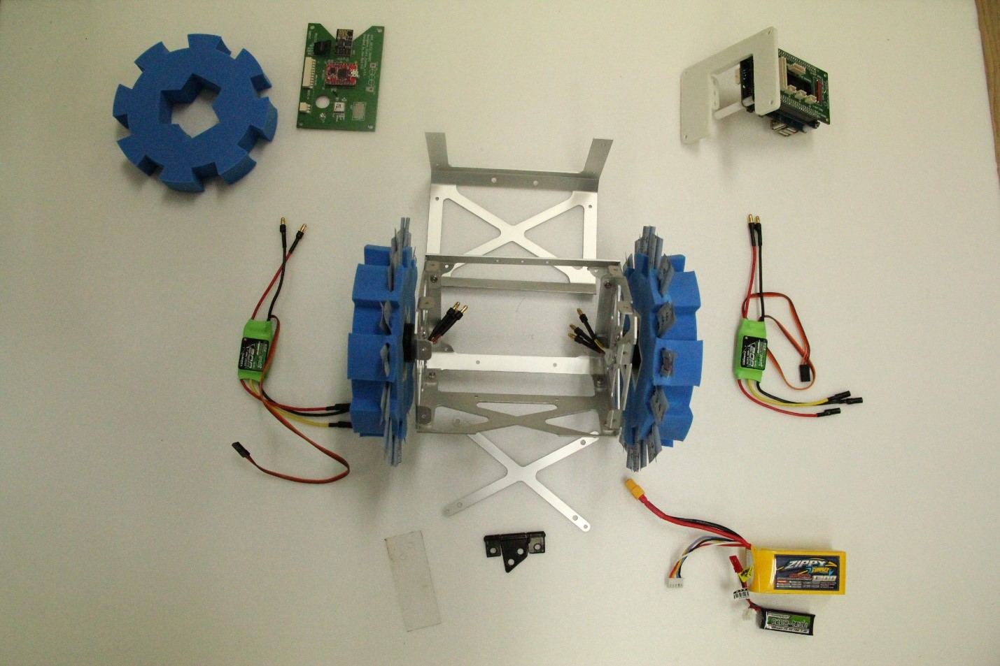
Figure 9 Assembled system stack and body
⑥	Assemble the other body frame and the part of STEP4 into together.(Figure 10)
⑦	Assemble the system stack of STEP5 with the system stack cover and navigation board into complete system stack (refer D-20-01)
 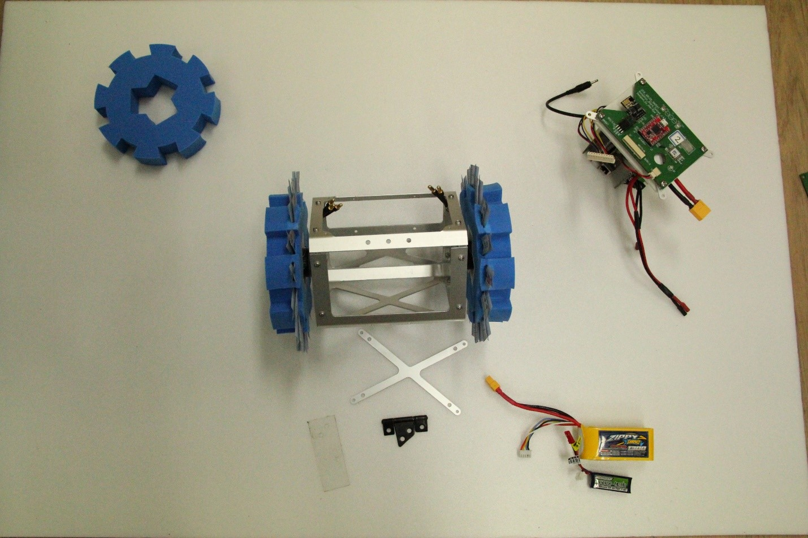
Figure 10 Assembled body (in progress) and complete system stack
⑧	Attach the stabilizer on the body (refer D-10-06).
⑨	Set the motor drivers on the bottom of inside of the body and connect the driver and motor (Black, Red, Yellow). After that, tie them with tape or cable ties.
 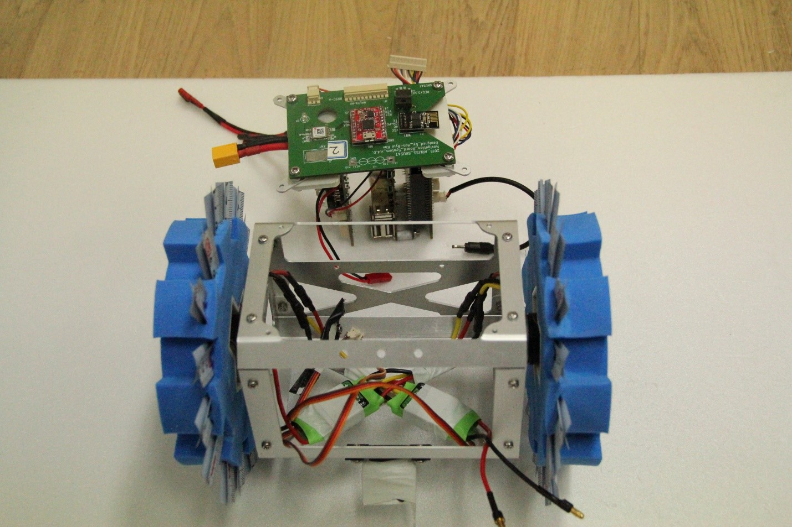
Figure 11 Assembled motor drivers and stabilizer
Caution! You should check the direction of the motors before you assemble. If it reversed, just swap two of the 3 cables.

⑩	Attach the camera part on front of the body.
⑪	Put the system stack into the body and assemble them together with 4 bolts. The holes for this bolts is tap hole. So, you don’t need nuts.
 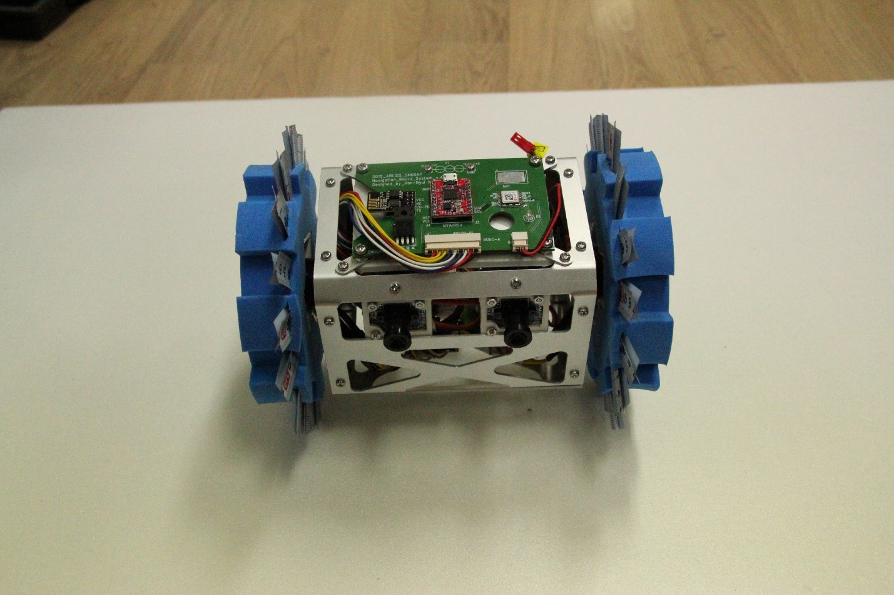
Figure 12 Assembled camera part and system stack
⑫	Put the batteries in back side of the body and tie them with tape or cable ties.
 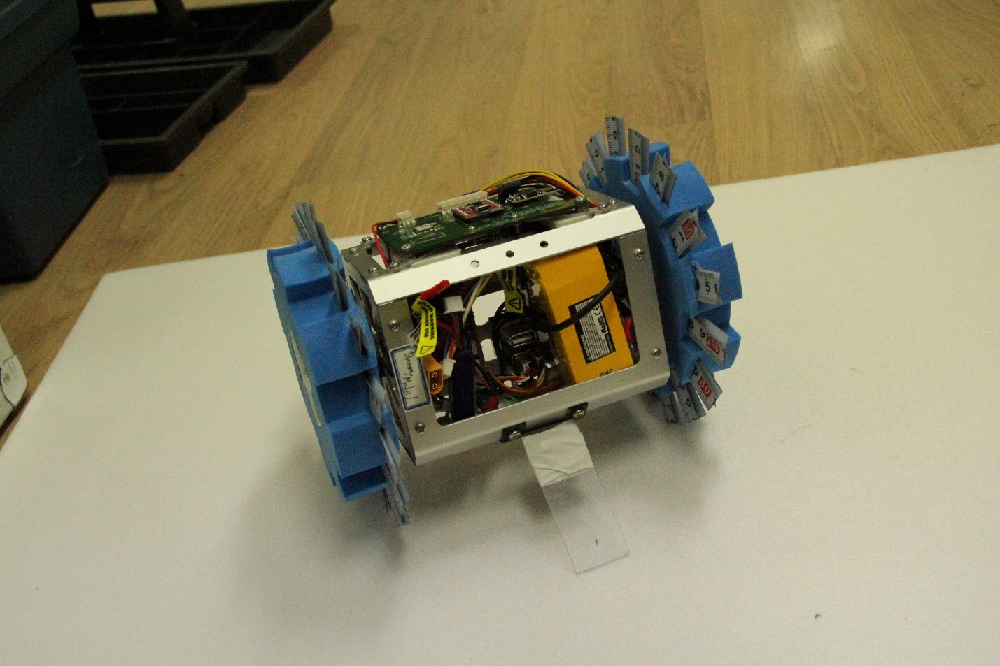
Figure 13 Complete cansat with batteries
Caution! The power cable for MCU can be pull off very easily. Therefore, you have to glue it before you launch.
 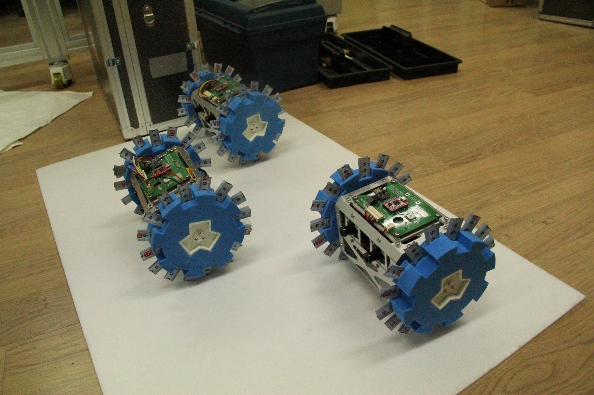
Figure 14 Complete cansats

##	6. Results
---
### 6.1 Strong point
- Internal electric system is easy to disassemble from the body structure.
- Internal system is effectively protected.
- The satellite is very stable as the mass center is rear-sided to the stabilizer.
- PCBs are positioned like radiator. The system, therefore, effectively exhaust heat produced by electric components. 
- The system doesn’t need any additional device to decouple a parachute.
- The whole structure is very easy to assemble.

### 6.2 Weakness
- External structure cannot block sand, dirt and dust arisen from the desert.
- As the body structure is too big, the satellite is easy to be stuck by obstacles.
- External structure is too heavy.
- A linkage between PCBs and structure is relatively weak as it made of plastic (ABS). 
- User has to pick out several lines to completely decouple the system stack.
- A hanger between a battery and the body is relatively weak.
- The navigation board (GPS, compass, wifi) is relatively vulnerable as they are placed on the outside of external aluminum structure. Furthermore, they are easy to be heated by the sunlight.
- Assembling a capsule with the satellite is very difficult. User has to replace heat wire whenever he/she assembles the capsule.
- The capsule got immense shock as the parachute is deployed.
- The satellite free falls if the capsule is destroyed. 
