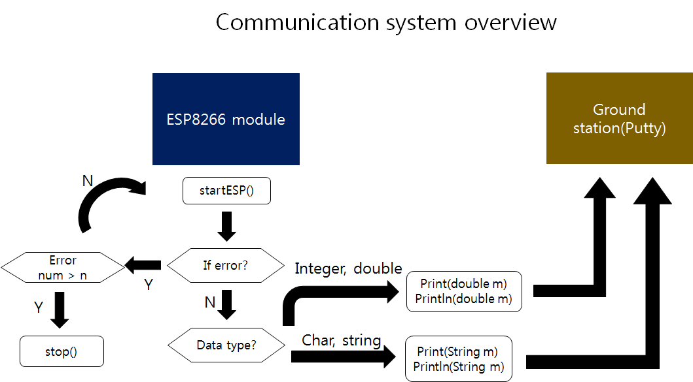

# Communication System

## 1. Change log

| ISS/REV |	Date |	Modifications |	Created/modified by |
| -- | -- | -- | -- |
| 1/0 |	11/23/2015 |	Design focus |	Hwijae Kwon gnlwo8599@gmail.com |
	
 
## 2. Design focus
### 2.1 Self error check
- Wifi module checks its wrong operation itself.
### 2.2 Send all type data
- Wifi module sends all  types of data.
### 2.3 Delete useless data
- Wifi deletes  useless data.
### 2.4 User friendly ground station
- Easy to make ground station.
### 2.5 Serial communication
- Serial communication with mcu.
### 2.6 Arduino IDE
- Easy to code. 

##3. Concept design
###3.1 Self error check
- Wifi module can check its wrong operation and reset itself.
- Wifi module can count its wrong operation number and stop operating after so many errors. 

###3.2 Send all type data
- Wifi module can send integer data.
- Wifi module can send double data.
- Wifi module can send char data.
- Wifi modue can send string data.

### 3.3 Delete useless data
- Wifi module can delete useless buffer not to waste space.
- The data, which was sent by module, has to be deleted to send new data.  

### 3.4 User friendly ground station
- Every notebook can be a ground station.
-Using ‘Putty’. 

## 4. Detail design
<Communication system overview>
※Please refer to ARL15-D-30-07-Software System_code manual(part ESP8266_P2P.h, ESP8266_P2P.cpp) and ESP8266 AT command manual.

###4.1 Self error check 
-  ‘startESP()’ resets wifi module by sending start signal to module. Also it checks if there is wrong operation. When it finds some errors module reset itself. If not, it gets IP address(‘getReadyIP()’) and starts sending message(‘Print()’). And it also counts the number of error(‘geterrornum1()’, ‘geterrornum2()’). So if the module still has some errors after many resets, it stops its operation(‘stop()’).   

### 4.2 Send all type data
- Wifi module only makes string type data. So we have to change the type of input data into string.
- Wifi module sends integer and double data (‘Print(double m)’, ‘Println(double m)’).  ‘Print(double m)’, ‘Println(double m)’ change integer input data into string by using String() fuction. String() function is basic function of Arduino IDE. It change integer data to string. If the type of input data is double, we have to use other fuction. First, change double into long integer. And do the same thing as  we do in the integer case.
- Wifi module also sends char and string data (‘Print(String m)’, Println(String m)’). As I say before, the output of wifi module is string type. So there’s no  other special function . 
- The function to send data imitates AT command manual.
### 4.3 Delete useless data
- We delete useless data not to waste space(‘clearbuffer()’).  And wait until the module sends previous input data completely(‘flush()’). After that, the next input data be sent.
### 4.4 User friendly ground station
- Wifi module can communicates with any laptop. We use ‘Putty’ program. It is very easy to use, but a little bit slow. We can also send data from laptop to wifi module with Putty. 
