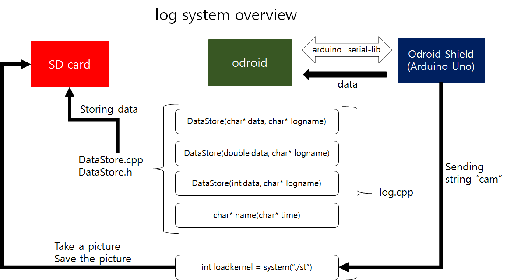

# Log Software

##		1. Change log

| ISS/REV |	Date |	Modifications |	Created/modified by |
| -- | -- | -- | -- |
| 1/0 |	02/18/2016 |	Design focus |	Hwijae Kwo gnlwo8599@gmail.com |

## 2. Design focus
### 2.1 Using Uart
- Connecting shield and odroid by uart communication.
### 2.2 Handling all types of data
- Handling int, double, char, string types of data. 
			
 
## 3. Concept design
###3.1 Using Uart
- Using uart communication between shield and odroid.
- Easy to code with github opensource code “arduino-serial-lib”.
- Storing data simply using basic arduino library fuctions.
###3.2 Handling all types of data
- There are all types of DataStore functions.
- void DataStore(char* data, char* logname), void DataStore(double data, char* logname), void DataStore(int data, char* logname)

## 4. Detail design
###4.1 log.cpp
<log system overview>
※Please refer to ARL15-D-30-07-Software System_code manual(part log.cpp, DataStore.cpp, DataStore.h, arduino-serial-lib)

###4.1.1 Using Uart
- We use “arduino-serial-lib”, github opensource code to connect odroid and Odroid shield. This code is based on the basic arduino IDE code, so it’s easy to use.
- Please refer the ARL15-D-30-07-Software System_code manual(arduino-serial-lib part) for more detail about the code
###4.1.2 Handling all types of data
- There are all types of DataStore functions. void DataStore(char* data, char* logname), void DataStore(int data, char* logname), void DataStore(double data, char* logname)
- It can also save picture data. When the odroid shield sends the string “cam” to odroid, log.cpp takes a picture and save it.
###4.1.3 More detail of DataStore
- When the odroid shield sends some data, it senses the data and save it as a “.txt” data. 
- The name of the “.txt” file is the starting up time and date of the odroid.(ex, 20151123 13:12:33)
- It notifies the saving start point by storing “Odroid on” on the top of the file.
- When the odroid takes a picture, it saves the string “cam”, and the time of the moment

##6. Results
###6.1 Data
 
-	We can save data which comes from  odroid shield. The data storing form is same as the form which we mentioned before(4.1.3) 
##	7. Reference
7.1  ARL15-D-30-07-Software System_code manual 
