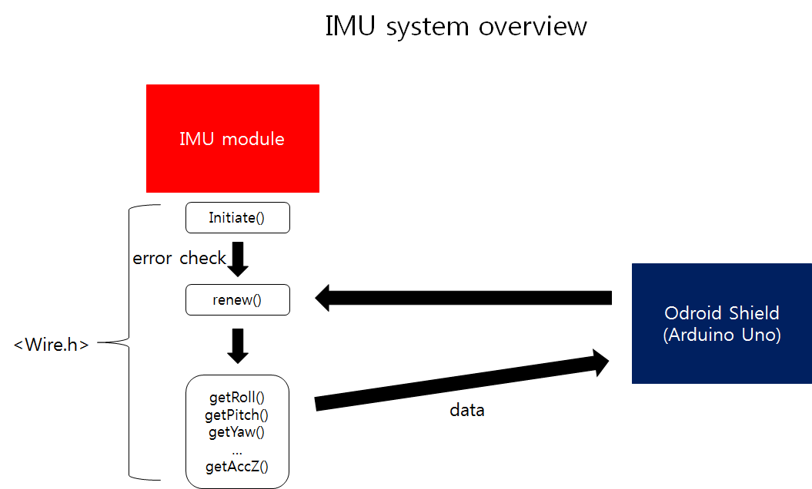
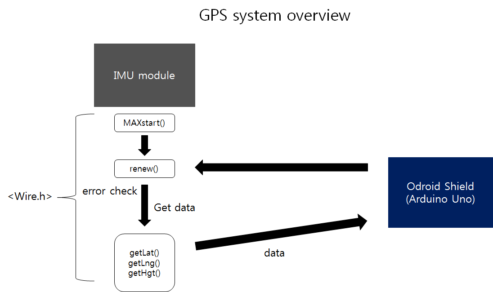
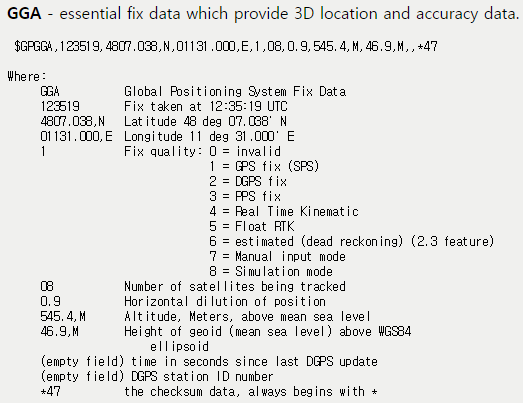
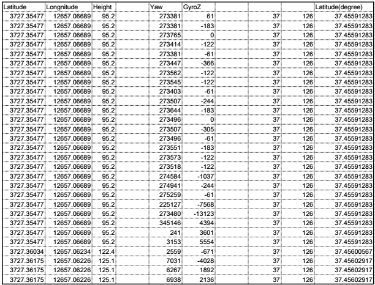

# Navigation System

## 1. Change log
---

| ISS/REV |	Date |	Modifications |	Created/modified by |
| -- | -- | -- | -- |
| 1/0 |	11/23/2015 |	Design focus |	Hwijae Kwon gnlwo8599@gmail.com |

			
 ## 2. Design focus
 ---
 ### 2.1   Using I2C
-  Using I2C communication. 
 ### 2.2 Self error check
- Wifi module checks its wrong operation itself.
 ### 2.3 Get every data
- Get every data from sensor.
 ### 2.4 Arduino IDE
- Easy to code.

## 3. Concept design
---
### 3.1 Using I2C
- We use I2C to operate IMU and GPS at the same time. It is impossible with Serial.
- We use <Wire.h> header from Arduino IDE.

### 3.2 Self error check
-  IMU can check its wrong operation using error check function.
- IMU and GPS module(MAX-6Q) can present their status in string and integer.

### 3.3 Get every data
- Get every data from IMU(roll, pitch, yaw, gyro X, gyro Y, gyro Z, acc X, acc Y, acc Z, Tem) using get function.
- Get every data from MAX-6Q(latitude, longitude, height) using get function.

## 4. Detail design
---
 ###4.1 IMU.h, IMU.cpp
<IMU system overview>
※Please refer to ARL15-D-30-07-Software System_code manual(part IMU.hm IMU.cpp)

####4.1.1 Using I2C
- We use <wire.h> header, basic header in Arduino IDE, for I2C. We edit IMU I2C example code as what we need. 
- So please refer the example code(https://github.com/withrobot/myAHRS_plus/tree/master/tutorial).  
####4.1.2 Self error check
- If IMU operates ordinary, it gets its own value(who_am_i, Status). So we can check the value to check error.
 ####4.1.3 Get every data
- ‘renew()’ function gets new data again and again. We make ‘get function’ to get data. The way to get data is using <Wire.h> and example code which we introduce before. By using <Wire.h>, we can control register, read them and get data. The type of data is double. Double is long enough to express roll, pitch, yaw and so on. There are getRoll(), getPitch(), getYaw(), getGyroZ() and so on, so we can get every data.

 ###4.2 MAX.h, MAX.cpp
<GPS system overview>
※Please refer to ARL15-D-30-07-Software System_code manual(part MAX.h, MAX.cpp)

####4.2.1 Using I2C
- We refer to Register Map of MAX-6Q  to get data. By using <Wire.h>, we can implement the register map in Arduino IDE.  First, get ready the register. Second, read the register and check if there are some data. If not reset itself. Third, read the register.
####4.2.2 Self error check
- As pointed out above, it can check if the register have data or not. If not, it resets itself until it gets data ordinary.
####4.2.3 Get every data
 
-  After read register, the data presents as NMEA(The National Marine Electronics Association). ‘renew()’ gets GPS data from NMEA. Many functions are in ‘renew()’. The NMEA data has latitude, longitude, and height data sequentially. So ‘getPhrase()’ separates each data. And ‘spellCheck ()’ checks the form of data. If the form is wrong, MCU regards it as error and operates ‘renew()’ function again. ‘Stof()’ change string type data to double. And ‘getLat()’, ‘getLng()’, and ‘getHgt()’ functions represent latitude, longitude, and height in double type.

##	5. Manufacture
---

## 6. Results
---
### 6.1 Data
 
- We get GPS, and IMU data completely. (The location is building 39, Seoul National University, Korea)

 
## 7. Reference
### 7.1  ARL15-D-30-07-Software System_code manual 

 
