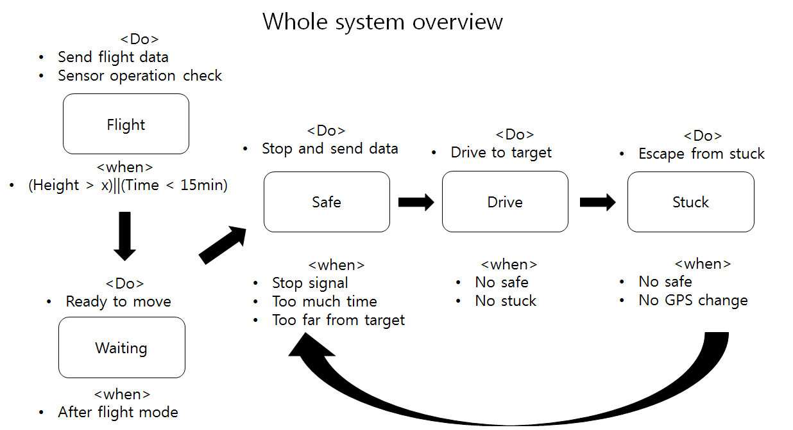

# Operation Software

##1. Change log
---
| ISS/REV |	Date |	Modifications |	Created/modified by |
| -- | -- | -- | -- |
| 1/0 |	02/18/2016 |	First issue |	Hwijae Kwon gnlwo8599@gmail.com |

##2. Design focus 
---
###2.1 Different operating modes 
- Five operating mode (Flight, Waiting, Safe, Drive, Stuck)
- Rover senses its state and change its mode
- Each mode has its state alarm function

##3. Concept design
---
###3.1 Different operation mode
-  Each state connects each other in rover operation but functionally independent.
-  Any mode cannot change any parameter of other codes.
-  All modes notify their state by using binary codes(0 : not in the state, 1 : in the state).
-  Rover checks its state itself and changes its mode.

## 4. Detail design
---
###4.1 Operating software
<Operating system overview>
※Please refer to ARL15-D-30-07-Software System_code manual(whole system.ino, Flight, Waiting, Safe, Drive, Stuck.cpp, Flight, Waiting, Safe, Drive, Stuck.h)

####4.1.1 Different operating mode
- Rover system operates like the algorithm above. First it has Flight mode and then waiting mode. After that, Safe, Drive, and Stuck mode rotates like the algorithm above. Rover always has the safe mode first to check whether the emergency state is occurred or not. 
- Each mode has its own error check function and check its state and then change mode.
####4.1.2 Flight mode
-  It checks the sensor state and then sends the sensor state data to the ground station.
- It also sends flight data to the ground station.
- When operation time is over 15 min or the height is below ‘x’ meter, the flight mode ends.
###4.1.3 Waiting mode 
- It operates right after the flight mode.
- It removes the capsule of rover and gets ready to move.
####4.1.4 Safe mode
- When some sensor break or the operation time is too long or the location of rover is too far from the target or the rover cannot move, it stops the rover and sends some signal to the ground station.
- Safe mode is the most important mode which has to be operated at first.
####4.1.5 Drive mode
- It makes the rover drive to the target. 
- It steers the rover with IMU and GPS data.
- When the rover get stuck or doesn’t move(we can know that by GPS data), the drive mode ends.
####4.1.6 Stuck mode 
- When the GPS data cannot change after drive mode and the rover is not in safe mode, it regards the rover gets stuck.
- It operates stuck escaping code(moving up and down, right and left for several times).
- When the GPS data change, the stuck mode ends.
-If the GPS data cannot change after several escaping operations, the stuck mode ends and safe mode strats.
 
##	5. Manufacture
---
 
##6. Results
---
###6.1 
- There’s  no problem with the whole system.ino, but operating with real data has some problem.
- Arduino ide is easy to use but not efficient in capacity, and the whole system.ino needs too much data(IMU, GPS, WIFI), so some capacity problem occurs. 
##	7. Reference
---
###7.1  ARL15-D-30-07-Software System_code manua 
