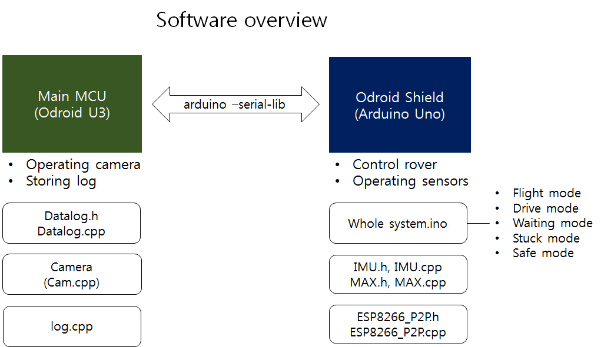

# Software System

## 1. Change log

| ISS/REV |	Date |	Modifications |	Created/modified by |
| 1/0 |	11/20/2015 |	Design focus |	Hwijae Kwon gnlwo8599@gmail.com |
| 1/0 |	11/23/2015 |	Design focus |	Hwijae Kwon Gnlwo8599@gmail.com |
 
 
## 2. Design focus
 
### 2.1 Functional separation
- Using two MCU according to function. (Odroid U3and Odroid shield)
- Easy to code
- Fast enough to take a picture
 
 
##3. Concept design
### 3.1 Functional separation
- We use  two MCU(Odroid  U3_main mcu, Odroid shield _sub mcu) according to functions for much faster speed,  much easier coding.
-  We take some pictures and save data effectively and control sub mcu by using Odroid U3(Ubuntu).
- We control sensors(GPS, WIFI, IMU) and motors easily by using Odroid shield(Arduino IDE). 
##		4. Detail design
### 4.1 Functional Separation view
 
 
 
-  Odroid U3 uses Ubuntu. It operates camera(Cam.cpp) and stores data log(Datalog.h, Datalog.cpp). And control Odroid shield(log.cpp). 
 - Odroid Shield operates like a Arduino Uno, so we use Arduino IDE. Arduino IDE is very useful to code sensors. So Odroid Shield controls rover(Whole system.ino) and sensors(IMU.h, IMU.cpp, MAX.h, MAX.cpp, ESP8266_P2P.h, ESP8266_P2P.cpp).
- Odroid   U3  and Odroid shield communicate with each other by using Serial(arduino-serial-lib.h, arduino-serial-lib.c). 

