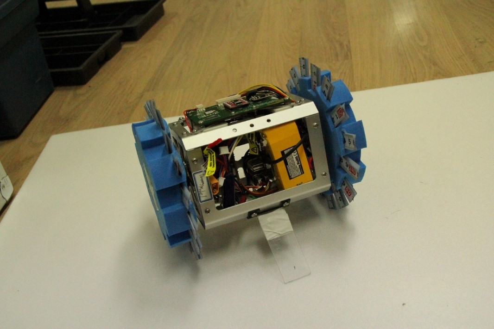
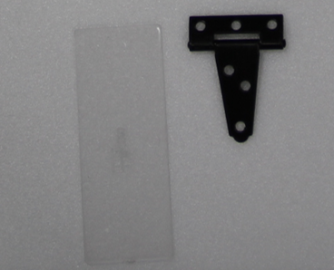
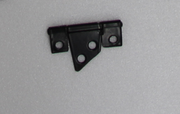
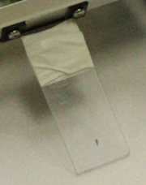

# Stabilizer Structure
## 1. Change log

| ISS/REV |	Date |	Modifications |	Created/modified by |
| 1/0 |	11/17/2015 |	First issue |	Jungjae Park pjj1115@mensakorea.org|
			

## 2. Design focus 
---
### 2.1 Stability
- The stabilizer should maintain balance of overall system.

### 2.2 Easily Changing parts

### 2.3 Less Friction
- Reduction of speed by the stabilizer should be minimized.

### 2.4 Mass
- The stabilizer should be as light as possible without losing durability.

 
 
 
##	3. Concept design
---
### 3.1 Foldable Mechanism
- Size of the satellite should be 146mm or less, thus the stabilizer is able to be folded up when not in use.

### 3.2 Balance
- The stabilizer is positioned on the middle of the satellite for preventing an imbalance.

### 3.3 Light material
- Mass of the satellite should be 1050g or less, thus the stabilizer should be consist of light material.

 
##	4. Detail design
---
### 4.1 Assembly view
 
    

Figure 1 Stabilizer

 
## 5. Manufacture
---
###5.1 Components
 
Figure 2 Plastic plate (100mm x 45mm) and T-shaped steel hinge (48mm x 47mm x 15mm)
- T-shaped steel hinge is purchased in the internet site (www.moongori.com)
###5.2 Assembling Process
①	Prepare two components; Plastic plate and T-shaped steel hinge
②	Cut the T-shaped steel hinge like the shape in the picture below
 
Figure 3 Worked T-shaped steel hinge

③	Attach the plastic plate on the worked hinge
 
Figure 4 Stabilizer
④	Attach the part of STEP3(this is stabilizer) on the assembled body part
 
Figure 5 Assembled satellite with stabilizer

## 6. Results
---
### 6.1 Strong point
- The stabilizer is able to foldable by the hinge part
   One side of the stabilizer and one side of the body face each other as the stabilizer is folded, then size of the satellite with the stabilizer nearly equal to the satellite without the stabilizer.
- When the stabilizer is damaged, the plastic plate part can be changed easily.
- The stabilizer weights just about 30 grams.

### 6.2 Weakness
- The plastic part of the stabilizer is broken compared to the other parts.
