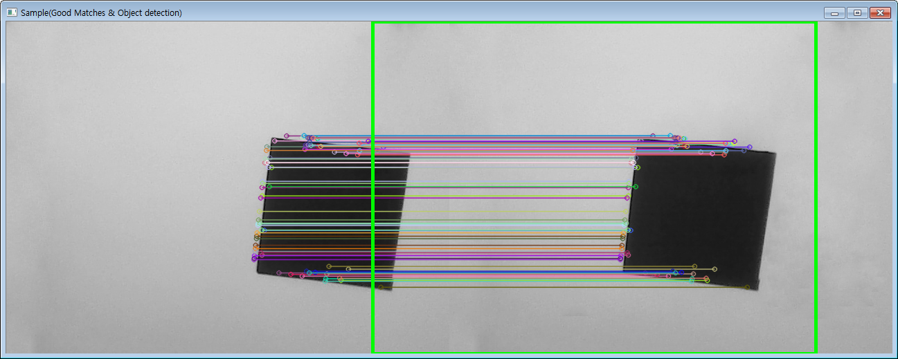
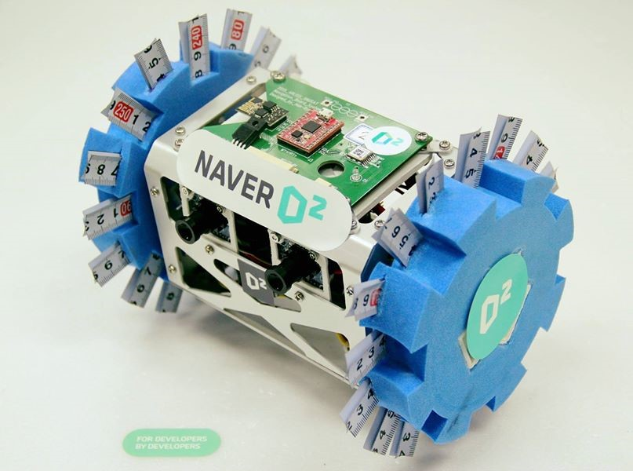
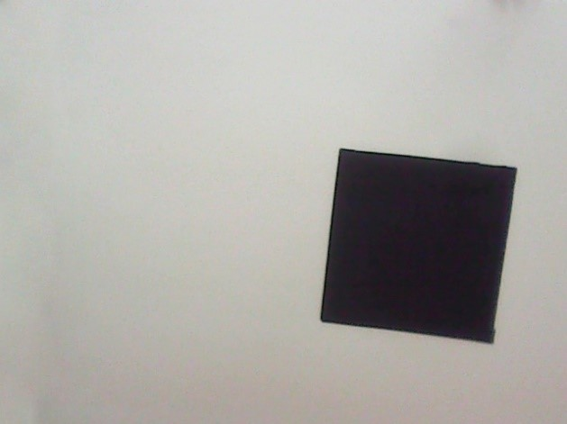
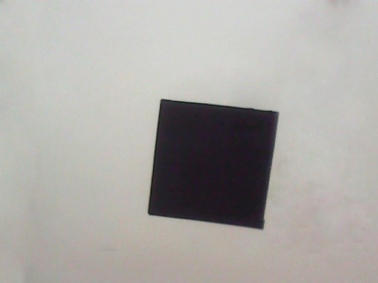

# Vision System

## 1. Design Focus
 
Vision system focuses on payload mission when other systems deal with running of satellite systems. So vision system design can be explained with payload mission. So for this system, it is important to consider the following articles. The five articles below are keypoints for overall algorithm of vision software.
1.	Capture
2.	Optic lobes
3.	OpenCV
4.	SURF
5.	OpenGL

## 2. Concept Design
The below diagram is simplified diagram of payload mission.

Satellite’s payload mission begins when it arrives at goal point. It starts with the execution of payload software.
First, to collect vision data satellite sets its status to capture mode. In capture mode satellite randomly takes picture of surroundings of goal point.
After collecting data, vision processing executed with withdrawal of satellite. Processing step is divided in image processing and data processing. Image processing purposes manufacturing raw image to vivid image. In fact, it gives analyzable image. Data processing uses the result of image processing. It is coordinate analysis process to get 3D object. So data processing is core process of vision system.
3D-Rendering is displaying step of result that obtained by data processing. So rendering can be like interpreting unreadable data to readable data. In this step 3d-coordinate is expressed with little sphere.  Due to poor sample data and hard analyze of sample, rendering can’t express the detail shape. But the object can be showed in simple shape. 

## 3.Detail Design
Vision system is main system for payload mission. The system can be focused on software side and hardware side.

### 3.1 Software
The software of vision system is made up of C++ and open libraries. The below table is library used for each function.
| Function |	Library	| Company |
| Collecting vision data |	OpenCV	| Intel |
| Data Processing |	SURF |	University of British Columbia |
| 3D-Rendering |	OpenGL |	Silicon Graphics |

Main system design is focused on SURF algorithm analysis. For 3D – Object Mapping vision system’s purpose, analyzing given 2D image data is most important. Therefore the algorithm is conjugated with principle of payload mission.
When setting a frame along the two axis of the 2D image, we can get 2D coordinate value of each pixel of image data. However when two image are available for same scene at different point of sight, two 2D coordinate value of same object can be obtained. So if these two frames are being integrated, 3D frame can be made by optic lobes. SURF Algorithm has main role in this step.
Surf Algorithm gets keypoint for each 2D image and sets basement for integrating each two frames of images. On software algorithm gets identical point in each 2D image with user set critical point for accuracy. When using below equation with each two points, we can get z-axis value for 3D frame.
Z=Bf/(X_L-X_R )
(X:x value at each frame,Z:z value in 3D frame,
B∶distance between two lense of CAM,f∶focal length)
Equation 1. calculating depth value1)

Acquisition of depth value(z-value) transforms 2D coordinate to 3D. As a result, each points can be displayed in 3D space.
 
Figure 1. result of keypoints by SURF

### 3.1.1 Collecting Vision Data
Algorithm for collecting vision data is executed when system software commands that the satellite entered to mission mode. This step is done with OpenCV Library in payload software.

### 3.1.2	Processing
Processing step is made up of SURF Algorithm. The algorithm runs with the two image input by CAM. Each image data is given as coordinate form. So SURF Algorithm takes keypoints in image data and transforms it to 2D coordinate. After it ends each keypoint goes through steps that calculate depth data which means Z coordinate value. Then in new image data as coordinate form, there exist all X, Y, Z coordinate value. This step is done with OpenCV and SURF Algorithm in ground station.

### 3.1.3	3D - Rendering
3D – Rendering displays processed data in 3D axis with mini sphere. Each keypoints are displayed in pre-calculated coordinate system with spheres so the object can be seen in 3D. In the coordinate system monitoring sight can be changed by user interface. Accordingly 3D object can be seen in all directions. This step is done with OpenGL in ground station.

### 3.2 Hardware
The hardware of vision system is made up of CAM, MCU and Camera Mount. CAM collects data, MCU makes CAM work and saves data, Camera Mount holds CAM. Design of hardware is focused on collecting accurate vision data. The reason of focusing accurate vision data is unstable outside environment. So obtaining vivid and workable data is really hard. Therefore, combination of Mount with CAM and the angle of CAM are designed proper for environment that satellite would blunder into. Also due to probability for fine data quantity of pictures are set on maximum.
CAM is connected on MCU with USB so the power problem doesn’t need to be considered. Also because of convenient connection 

 
Figure 2. combined CAM on satellite

## 4.Production
- OpenCV

Version : v.2.4.10
Used for : CAM control, SURF

- SURF

Implemented in OpenCV v.2.4.10 as additional library.

- OpenGL

Version : 4.5(latest)
Used for : Displaying method

- Source Code

https://github.com/HanByulKim/SNUSAT_ARLISS2015_Vision

- Collected Data
   

- SURF Result
 

- Rendering Result
 

## 5.Trouble Shooting
	.dll problem
Because of patent problem in SURF algorithm, to use SURF in OpenCV, additional libraries and version check are needed. When searching and downloading missing .dll files and headers on proper path it can be cleared.

- image quality problem

As said in above, bad image can’t be processed properly in Processing step. Keypoints could not discovered in bad image due to mathematical problems for orthogonal vectors. As a result bad image gets a few keypoints and shows strange shape in 3D coordinate system. So by taking data as many as possible and discarding bad data, selection of good image can be done and the problem gets solved.

- For advanced version

The latest version of vision software can display the simple shape approximately but cannot shows exactly and has hardship for complicated object. So for advanced version in this software canny function will be applied. Canny gives the border of the object so that the algorithm can recognize it exactly.
Statistic method will be applied also. When canny divides the district of inner and outer of object statistic analyze can be made based on border.
The above two methods should give high 3D object display quality for next advanced version.

6.References

	A. Ardeshir Goshtasby., 2-D and 3-D image registration for medical, remote sensing, and industrial applications, 2005, Wiley
