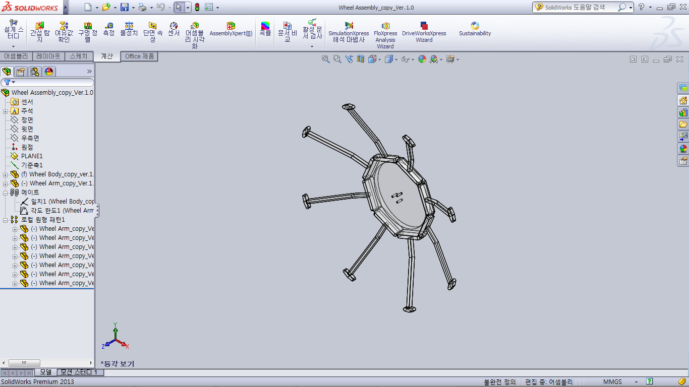
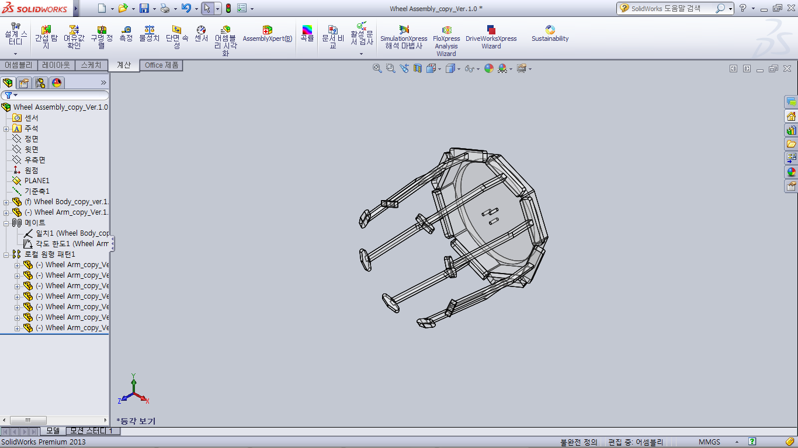
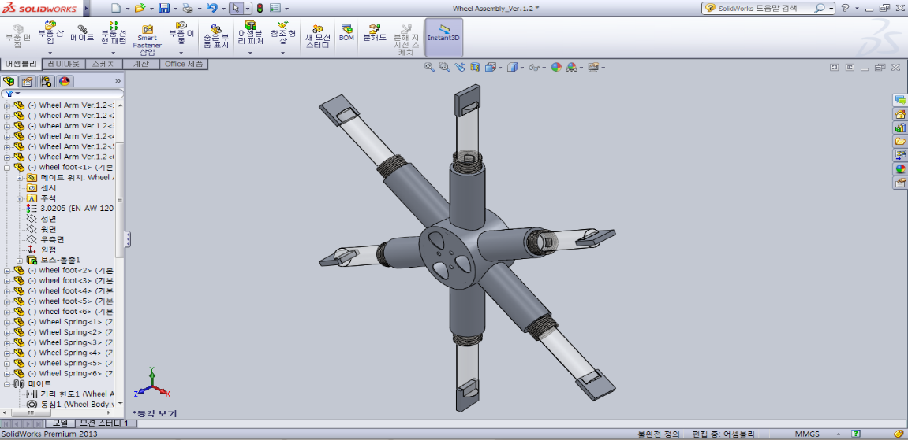
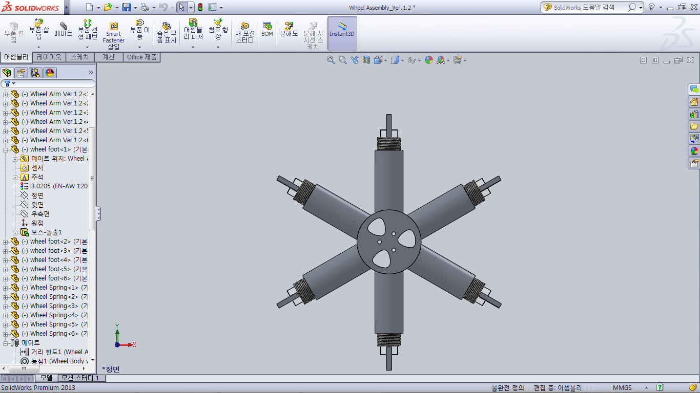
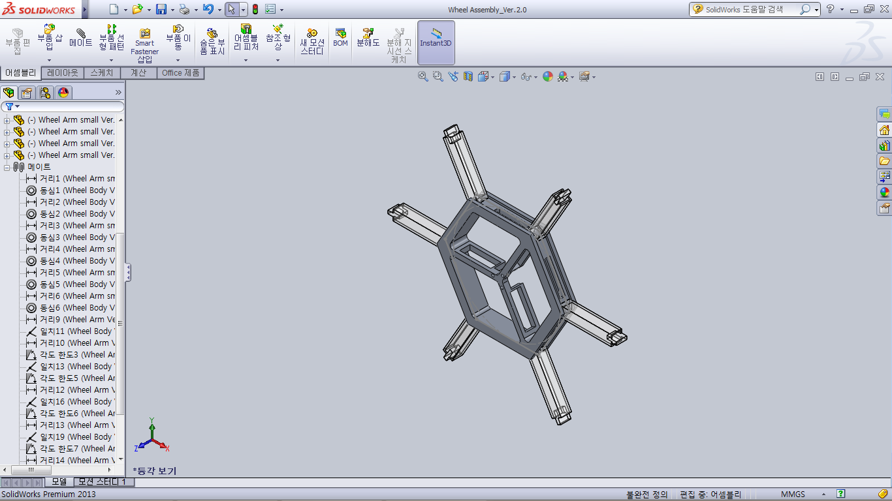
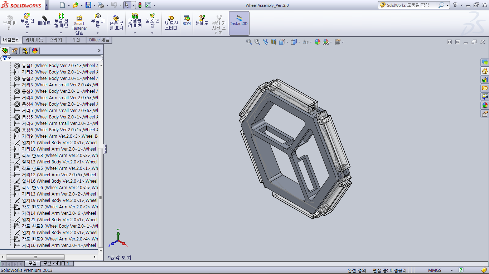
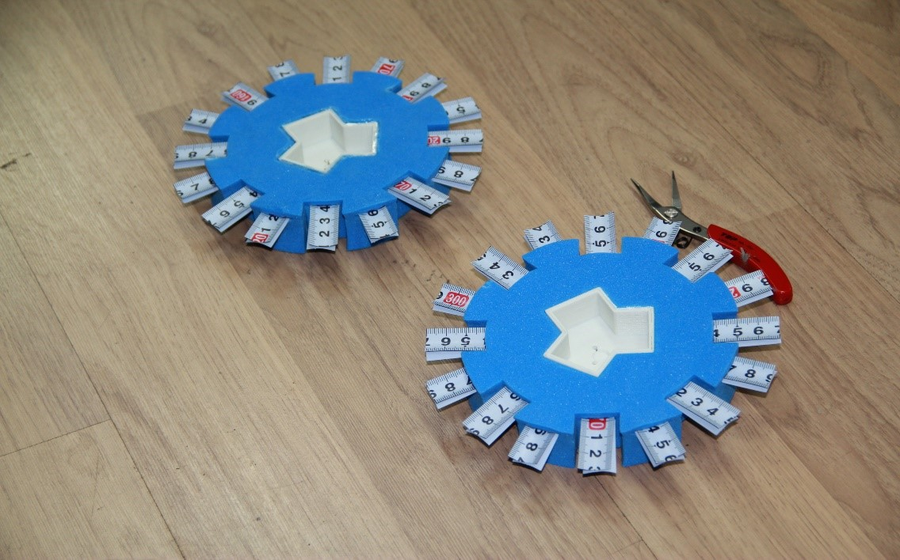

# Wheel Structure

## 1. Change log
---
| ISS/REV |	Date |	Modifications |	Created/modified by |
| -- | -- | -- | -- |
| 1/0|	01/13/2016|	First issue|	Minyoung Kang|
| 1/1 |	01/14/2016 |	Format conversion |	Juhyeon Kim kjhunkk@gmail.com

## 2. Design focus 
---
### 2.1 System Requirements
1) SNUSAT-STR-06: It must climb over the bump which is below 15mm.
2) SNUSAT-STR-11 – There is no interference of wheels when it runs.
3) SNUSAT-STR-12 – It must resist outside interference and keep status “stable” when it makes a step forwards or backwards.
4) SNUSAT-STR-13 – It must keep status “stable” when it accelerates or brakes.

## 3. Concept design
---
The first ‘concept design’ was started to satisfy system requirements. Our team brainstorms diverse alternatives which can realize our ideas and system requirements. After that, we selected the most effective and economical alternatives. At entire process, all members participated and gave us creative ideas.
	
### 3.1 Concept Design Idea
1) Make wheel’s diameter big as much as we can.
2) Make a spoke for running over obstacle easily.
3) Have to have normal-force concentrating structure. Because contest field has many mud-made obstacle.

### 3.2 Concept Design
We have to increase wheel’s diameter as much as we can. Because the bigger diameter is, the less robot is caught by obstacle. It is essential factor but we have limit of robot’s size. We have to design effective way to increase diameter. Finally we decide we should make variable-diameter wheel which has small diameter when it gets in rocket and has big diameter when it lands on the ground.
Although we wanted to make wheel which has whole round-shape for stable running, but keeping both requirements (running stable and climbing over obstacle) was so difficult and there was no answer. Therefore, we only remain spoke of a wheel. The spoke has to have elasticity that can be folded and stretch out. After stretching out, it mustn’t be folded and can chop the ground and go. So it has to have proper strength.
Finally we completed our concept design by deciding to make variable-diameter wheel that its spoke stretches out.

## 4. Detail design
### 4.1 Previous designs
To satisfy upper concept design factors, we suggested three versions of variable-diameter wheel. Each version was named by ver.1.0, ver.1.2, ver.2.0. Each suggestion’s property, strength and weakness is like that below.
 	 
After stretching
Diameter : 323.24mm

Before stretching
Diameter : 140.00mm

Picture 1. Wheel design Ver.1.0
 	 
After stretching
Diameter : 211.00mm	

Before stretching
Diameter : 121.00mm

Picture 2. Wheel design Ver.1.2
 	 
After stretching
Diameter : 220.00mm

Before stretching
Diameter : 130.00mm

Picture 3. Wheel design Ver.2.0
Table 1. Strength/Weakness Analysis of each wheel design

| Type	| Strength |	Weakness |
| -- | -- | -- |
| Ver.1.0 |	Spoke doesn’t disturb maintaining form of capsule. / It has many spokes so is stable. / After stretching, diameter is big | Weak durability. Weight is the biggest Spoke can disturb satellite’s body so they can have interference./ After stretching, we don’t know how to fix the spokes./ Before stretching, it also have big diameter.| 
| Ver.1.2 |	Strong durability. Before stretching, it has small diameter so we have spare space.| Difficult to make one-body wheel. Spare to decrease the weight is little. Difficult to control spring’s elastic modulus. We have little confidence of spring’s effect. After stretching, we don’t know how to fix the spokes.| 
| Ver.2.0 |	The lightest weight. Easy to make one-body wheel. Easy to control spring’s elastic modulus. Hexagon shape is easier to make it than circular shape.|	It has little spare to decrease the weight. We have little confidence of spring’s effect. After stretching, we don’t know how to fix the spokes.| 

We experimented those three version of wheel. If we use the lightest material, ABS, one-side wheel is more than 100g so each wheel take 10% of the whole weight of satellite. Furthermore, every version of wheel has to control its variability by spring so we can’t be convinced. Those designs are uneconomical, inefficient, non-perfect design. Finally we simplified our problem by having elasticity naturally and reducing its weight as possible as we can. In conclusion, wheel body is decided to make from sponge and spoke is decided to make from iron made tapeline.

### 4.2 Final design
 
Picture 6. Final Design of Wheel
Final design of wheel uses 32 parts of tapeline spoke. Double tapeline spoke is put in one space and it has opposite direction. Tapeline spoke is put at outer side of wheel because if it close to robot’s body, one of body and spoke will be broken. 

 
